<table>
<tr>
  <td colspan="4" align="center"><h1>Edge AI Tutorials</h1>
  </td>
</tr>
<tr>
<td colspan="4" align="center"><h1>YOLOv3 Tutorial:  Darknet to Caffe to Xilinx DNNDK</h1>
</td>
</tr>
</table>


# Introduction

YOLOv3 is one of the most famous CNN for Object Detection. It was developed in a ML framework different from [Caffe](https://github.com/BVLC/caffe) which is named [Darknet](https://github.com/pjreddie/darknet).
To run it on the Xilinx® DNNDK release, you need to convert it into a format compliant with Caffe. For this, you will need a special converter to convert Darknet to Caffe and generate the ``yolov3.prototxt`` and ``yolov3.caffemodel`` files as input to the DNNDK.

This Tutorial describes the process of converting the YOLOv3 CNN (originally trained in [Darknet](https://github.com/pjreddie/darknet) with the [COCO](http://cocodataset.org/#home) dataset (80 classes)) before quantizing it with Xilinx DNNDK 2.0.8 release and run on a <a href="https://www.xilinx.com/products/boards-and-kits/ek-u1-zcu102-g.html">ZCU102</a> target board.

The conversion from Darknet to Caffe supports **YOLOv2/tiny**, **YOLOv2**, **YOLOv3/tiny**, and **YOLOv3** basic networks. This conversion relies on a special fork of Caffe (designed by DeePhi), which is placed in the [caffe-master](caffe-master) folder.


## Prerequisites

1. Ubuntu OS 14.04 or 16.04. For more information, see chapter 1 in the DNNDK User Guide [UG1327](https://www.xilinx.com/support/documentation/user_guides/ug1327-dnndk-user-guide.pdf).

2. DNNDK tools and image for evaluation boards (zcu102 used in this example). For more information, see [Xilinx AI Developer Hub](https://www.xilinx.com/products/design-tools/ai-inference/ai-developer-hub.html#edge).

3.  [Python 2.7](https://www.python.org/download/releases/2.7/) and its [virtual environments](https://docs.python-guide.org/dev/virtualenvs) for Ubuntu OS.

4. The official YOLOv3-608 network model trained with COCO dataset is available [here](https://pjreddie.com/darknet/yolo/). Download the [`yolov3.weights`](https://pjreddie.com/media/files/yolov3.weights) file (around 248 MB) and place it in the [`0_model_darknet`](example_yolov3/0_model_darknet/) folder.


## Project Organization

Assuming the working directory is named ```yolo_convertor``` in the folder ```$ML_DIR```, the project is organized with the following directory structure:
```
yolo_convertor
.
├── caffe-master.tar.gz
├── darknet_origin.tar.gz
├── example_yolov3
│   ├── 0_convert.sh
│   ├── 0_model_darknet
│   │   ├── yolov3.cfg
│   ├── 0_test_darknet.sh
│   ├── 1_model_caffe
│   │   └── v3.prototxt
│   ├── 1_test_caffe.sh
│   ├── 2_model_for_quantize
│   │   ├── v3_example.prototxt
│   ├── 2_quantize.sh
│   ├── 3_compile.sh
│   ├── 3_model_after_quantize
│   │   └── deploy.prototxt
│   ├── 4_model_elf
│   │   ├── yolo_kernel_graph.jpg
│   │   └── yolo_kernel.info
│   ├── 5_file_for_test
│   │   ├── calib_data.tar
│   │   ├── calib.txt
│   │   ├── coco.data
│   │   ├── coco.names
│   │   ├── image.txt
│   │   └── test.jpg
│   └── results
├── images
├── README.md
├── yolo_convert.py
└── yolov3_deploy.tar.gz.partaaa
└── yolov3_deploy.tar.gz.partaab
```

## Preparing the Repository

The [tutorial.sh](tutorial.sh) script sets the ```$ML_DIR``` variable to your working directory (for example ```/home/root2/ML/YOLOv3/yolov3_convertor```  is shown in all the examples in this tutorial).
```
cd <YOUR_WORKING_DIR>/yolov3_convertor
bash -v tutorial.sh
```
The [tutorial.sh](tutorial.sh) script also performs the following actions:

- Uncompresses all the ```*.tar.gz``` files in the repository, by executing the following commands:
```
$ tar -xvf caffe-master.tar.gz
$ tar -xvf darknet_origin.tar.gz
$ cat yolov3_deploy.tar.gz.part* > yolov3_deploy.tar.gz
$ tar -xvf yolov3_deploy.tar.gz
$ rm yolov3_deploy.tar.gz.part*
$ cd example_yolov3/5_file_for_test
$ tar -xvf calib_data.tar
$ cd ../../
```

- Runs the following commands from the working directory:
```
$ find . -type f -name "*.txt"   -print0 | xargs -0 dos2unix
$ find . -type f -name "*.data"  -print0 | xargs -0 dos2unix
$ find . -type f -name "*.cfg"   -print0 | xargs -0 dos2unix
$ find . -type f -name "*.names" -print0 | xargs -0 dos2unix
```
You will need to have the [dos2unix]( http://archive.ubuntu.com/ubuntu/pool/universe/d/dos2unix/dos2unix_6.0.4.orig.tar.gz) utility installed in your Linux PC before executing them.

- Sets the path in the [coco.data](example_yolov3/5_file_for_test/coco.data) file in the [5_file_for_test](example_yolov3/5_file_for_test/) folder, according to the following ( ```PATH_TO``` depends on your environment):
```
valid = /PATH_TO/example_yolov3/5_file_for_test/image.txt
names = /PATH_TO/example_yolov3/5_file_for_test/coco.names
```

- Sets the test images path in the [image.txt](example_yolov3/5_file_for_test/image.txt) file in the [5_file_for_test](example_yolov3/5_file_for_test/) folder, according to the following:
```
PATH_TO/example_yolov3/5_file_for_test/xxx.jpg
```

- Sets the Caffe python interface path in the second line of the [yolo_convert.py](yolo_convert.py) script as in the following (```PATH_TO``` depends on your environment):
```
sys.path.append('/PATH_TO/yolo_convertor/caffe-master/python')
```


## Processing Flow

Starting from a YOLOv3 CNN trained directly in Darknet with the COCO dataset, in this tutorial you will adopt the following flow:

1. Convert the Darknet model into a Caffe model using the [0_convert.sh](example_yolov3/0_convert.sh) script.

2. Test the object detection behavior of either the original Darkenet or the Caffe model with the [0_test_darknet.sh](example_yolov3/0_test_darknet.sh) and [1_test_caffe.sh](example_yolov3/1_test_caffe.sh) scripts respectively.

3. Quantize the Caffe model generated in the previous step with the DNNDK decent tool by launching the   
[2_quantize.sh](example_yolov3/2_quantize.sh) script.

4. Compile the ELF file for the DPU IP core on the ZCU102 target board with the [3_compile.sh](example_yolov3/3_compile.sh) script.

5. Build the final application and deploy it on the ZCU102 board. It is archived in the [yolov3_deploy.tar.gz](yolov3_deploy.tar.gz) file, for your refererence.

# Compile Darknet and Caffe  

Use the following commands to compile Darknet in the [darknet_origin](darknet_origin) folder:
```
$ cd darknet_origin
$ make -j
$ cd ..
```

Use the following commands to compile Caffe in the [caffe-master](caffe-master) folder:

>**Note**: Do this from your Python virtual environment.
```
$ cd caffe-master
$ make -j
$ make pycaffe
$ make distribute
$ cd ..
```

You will use this Caffe fork to convert the model from Darknet to Caffe, but you do not need it for training(as the training was already done in the Darknet framework). Therefore, be sure to set the compilation for CPU only in the [Makefile.config](caffe-master/Makefile.config) file , as illustrated in the following lines:
```
# cuDNN acceleration switch (uncomment to build with cuDNN).
#USE_CUDNN := 1
# CPU-only switch (uncomment to build without GPU support).
CPU_ONLY := 1
```

Now, use the following commands to set the ```CAFFE_ROOT``` environmental variable to the folder of the newly installed Caffe and update the other variables consequently.

```
export CAFFE_ROOT=~/ML/YOLOv3/yolo_converter/caffe-master
export LD_LIBRARY_PATH=$CAFFE_ROOT/distribute/lib:$LD_LIBRARY_PATH
export PYTHONPATH=$CAFFE_ROOT/distribute/python:/usr/local/lib/python2.7/dist-packages/numpy/core/include/:$PYTHONPATH
```

To test the environment, execute the following command line:
```
$ python -c "import caffe; print caffe.__file__"
```
You will see commands as shown in the following figure:

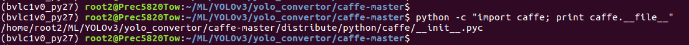


# The YOLOv3 Example

This sections details the flow described in 'The Processing Flow' section, using the YOLOv3 CNN as an example.
The files are placed in the [example_yolov3](example_yolov3) folder, which is organized as shown below:
```
example_yolov3/
├── 0_convert.sh
├── 0_model_darknet
│ ├── yolov3.cfg
│ └── yolov3.weights
├── 0_test_darknet.sh
├── 1_model_caffe
│ ├── v3.caffemodel
│ └── v3.prototxt
├── 1_test_caffe.sh
├── 2_model_for_quantize
│ ├── v3.caffemodel
│ ├── v3_example.prototxt
│ └── v3.prototxt
├── 2_quantize.sh
├── 3_compile.sh
├── 3_model_after_quantize
│ ├── deploy.caffemodel
│ └── deploy.prototxt
├── 4_model_elf
│ ├── dpu_yolo.elf
│ ├── yolo_kernel_graph.jpg
│ └── yolo_kernel.info
├── 5_file_for_test
│ ├── calib_data
│ ├── calib.txt
│ ├── coco.data
│ ├── coco.names
│ ├── image.txt
│ ├── test.jpg
│ ├── yolov3_caffe_result.txt
│ └── yolov3_darknet_result.txt
├── detection.jpg
├── results
```


## Step 1: Darknet to Caffe Model Conversion

Use the following commands to launch the Darknet to Caffe conversion process:
```
$ cd example_yolov3
$ bash 0_convert.sh
```

The output is shown in the following figure:
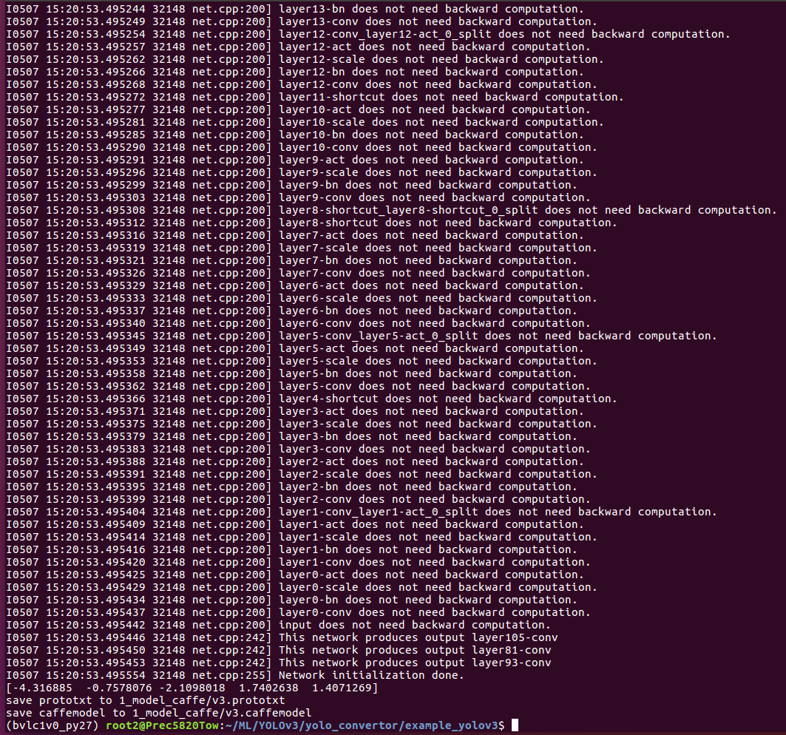

The [0_convert.sh](example_yolov3/0_model_darknet/0_convert.sh) script converts the Darknet model(stored in the [0_model_darknet](example_yolov3/0_model_darknet/) folder), to a Caffe model (stored in the [1_model_caffe](example_yolov3/1_model_caffe) folder), using the [yolo_convert.py](yolo_convert.py) script.

The [0_convert.sh](example_yolov3/0_model_darknet/0_convert.sh) script performs the following actions to generate the two Caffe files, [v3.prototxt](example_yolov3/1_model_caffe/v3.prototxt) and
[v3.caffemodel](example_yolov3/1_model_caffe/v3.caffemodel):

```
$ python ../yolo_convert.py \
       0_model_darknet/yolov3.cfg        #path to Darknet cfg file \
       0_model_darknet/yolov3.weights    #path to Darknet weights file \
       1_model_caffe/v3.prototxt         #path to Caffe prototxt file \
       1_model_caffe/v3.caffemodel       #path to Caffe caffemodel file
```

## Step 2: Test the Darknet and Caffe YOLOv3 models

The files that are required to test both the Darknet and Caffe models are placed in the [5_file_for_test](example_yolov3/5_file_for_test) folder. Ensure to delete all the ```*result*.txt``` files in the repository

### Test Darknet

Execute the following commands to test Darknet:
```
$ cd example_yolov3
rm results/*
rm 5_file_for_test/yolov3_*_result.txt
$ bash 0_test_darknet.sh
```
You will see the following:
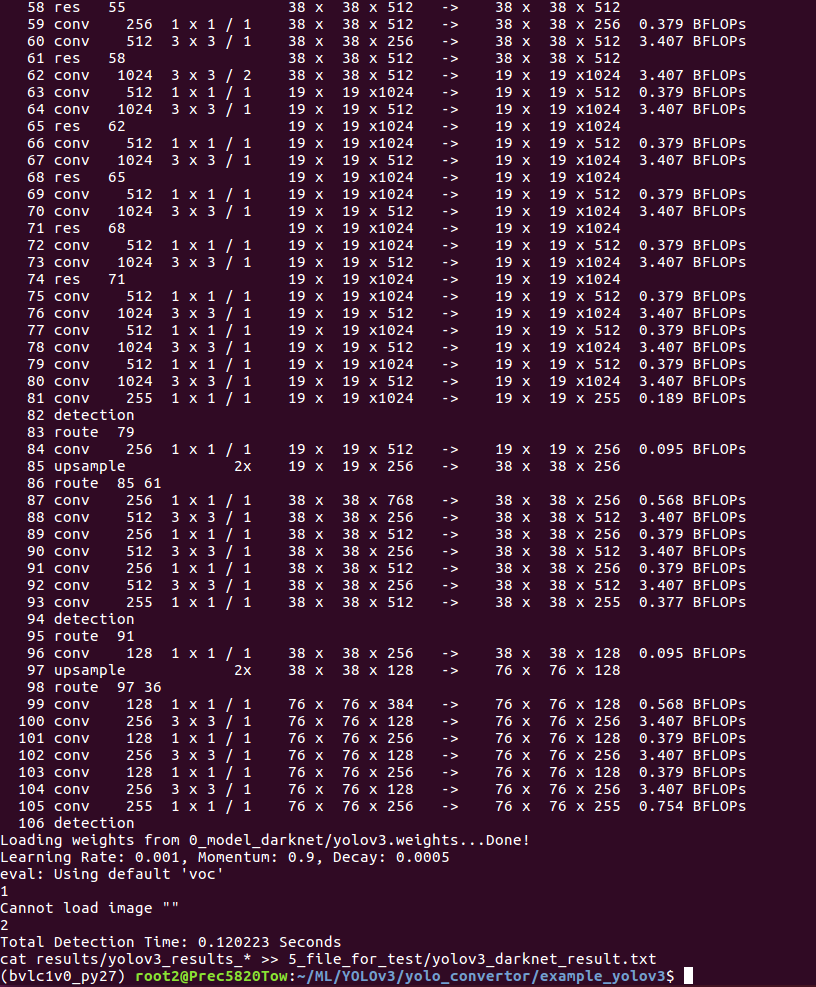


The [0_test_darknet.sh](example_yolov3/0_test_darknet.sh) script uses the standard Darknet framework to get the detection result of the network, which is saved as [yolov3_darknet_result.txt](example_yolov3/5_file_for_test/yolov3_darknet_result.txt).
The folder and file name in the script can be modified accordingly.

>**Note:** The confidence threshold will determine the number of bounding boxes that will be the output of the final detection result. If the threshold needs to be changed in testing the Darknet model, modify line 419 of the [detector.c](darknet_origin/examples/detector.c) file, clean and re-make Darknet, and run ```0_test_darknet.sh``` again.


### Test Caffe

Execute the following commands to test Caffe:
```
$ cd example_yolov3
$ bash 1_test_caffe.sh
```
You will see the following:
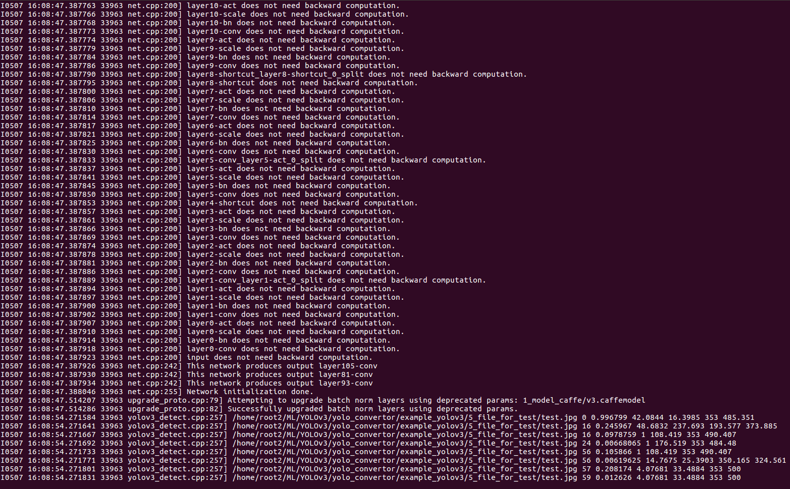

The [1_test_caffe.sh](example_yolov3/1_test_caffe.sh) script uses the functions added to the standard Caffe framework by DeePhi to get the detection result of the network after the conversion. The final detection result is saved in the [5_file_for_test](example_yolov3/5_file_for_test) folder as [yolov3_caffe_result.txt](example_yolov3/5_file_for_test/yolov3_caffe_result.txt). The path names, ```classes```, and ```anchorCnt``` parameters in the script can be modified accordingly.

The following is the [1_test_caffe.sh](example_yolov3/1_test_caffe.sh) script:
```
$ ../caffe-master/build/examples/yolo/yolov3_detect.bin \
                                     1_model_caffe/v3.prototxt         #path to prototxt \
                                     1_model_caffe/v3.caffemodel       #path to caffemodel \
                                     5_file_for_test/image.txt         #image.txt specifies images for test \
                                     -confidence_threshold 0.005       #threshold for confidence \
                                     -classes 80                       #class num of network \
                                     -anchorCnt 3                      #anchor num of network \
                                     -out_file 5_file_for_test/yolov3_caffe_result.txt
```

If you plan to use the Darknet network model with different anchor parameters, modify line 134 of the [``yolov3_detect.cpp``](caffe-master/example/yolo/yolov3_detect.cpp) file according to anchor parameters in the ```cfg``` file. In the official YOLOv3 model, the anchor parameters of the Darknet model are the following:
```
anchors = 10,13, 16,30, 33,23, 30,61, 62,45, 59,119, 116,90, 156,198, 373,
```
Therefore, the corresponding values in [``yolov3_detect.cpp``](caffe-master/examples/yolo/yolov3_detect.cpp)  are:
```
float biases[18]= {10,13, 16,30, 33,23, 30,61, 62,45, 59,119, 116,90, 156,198, 373,326};
```

>**Note:** To test the Caffe networks converted from **YOLOv2/tiny** **YOLOv2** basic networks, use ```yolov2_detect.bin``` placed in the Caffe build examples folder (```caffe-master/build/examples/yolo/```), and modify the related parameters in [``yolov2_detect.cpp``](caffe-master/examples/yolo/yolov2_detect.cpp).

>**Note:** To test the Caffe networks converted from **YOLOv3/tiny** **YOLOv3** basic networks, use ```yolov3_detect.bin``` placed in the Caffe build examples folder (```caffe-master/build/examples/yolo/```) and modify the related parameters in [``yolov3_detect.cpp``](caffe-master/examples/yolo/yolov3_detect.cpp).


### Detection Result Comparison

The Darknet detection results for the input image [``test.jpg``](example_yolov3/5_file_for_test/test.jpg) extracted from the [yolov3_darknet_result.txt](example_yolov3/5_file_for_test/yolov3_darknet_result.txt) file (you might get the same results but in a different order), are as follows:

```
test 0.006225 14.738144 25.408401  350.169128 324
test 0.006644 1.000000  176.401611 353.000000 484
test 0.012753 4.063614  33.500977  353.000000 500
test 0.097317 1.000000  108.329865 353.000000 490
test 0.105670 1.000000  108.329865 353.000000 490
test 0.209107 4.063614  33.500977  353.000000 500
test 0.247878 48.710381 237.655457 193.563782 373
test 0.996792 42.086151 16.412552  353.000000 485
```
The Caffe detection results for the  example image extracted from the [yolov3_caffe_result.txt](example_yolov3/5_file_for_test/yolov3_caffe_result.txt) file (you might get the same results but in a different order), are as follows:

```
test.jpg 0.00619627 14.7674 25.3904 350.165 324
test.jpg 0.00668068 1       176.519 353     484
test.jpg 0.0126261  4.07681 33.4886 353     500
test.jpg 0.0978761  1       108.419 353     490
test.jpg 0.105866   1       108.419 353     490
test.jpg 0.208174   4.07681 33.4886 353     500
test.jpg 0.245967   48.6832 237.693 193.577 373
test.jpg 0.996799   42.0844 16.3986 353     485
```
The difference of confidences and bonding box coordinates between Darknet and Caffe model is negligible.


## Step 3: Quantize the Caffe Model

Use the following commands to quantize the Caffe model:
```
$ cd example_yolov3
$ cp 1_model_caffe/v3.caffemodel  ./2_model_for_quantize/
$ bash 2_quantize.sh
```
You will see the following:
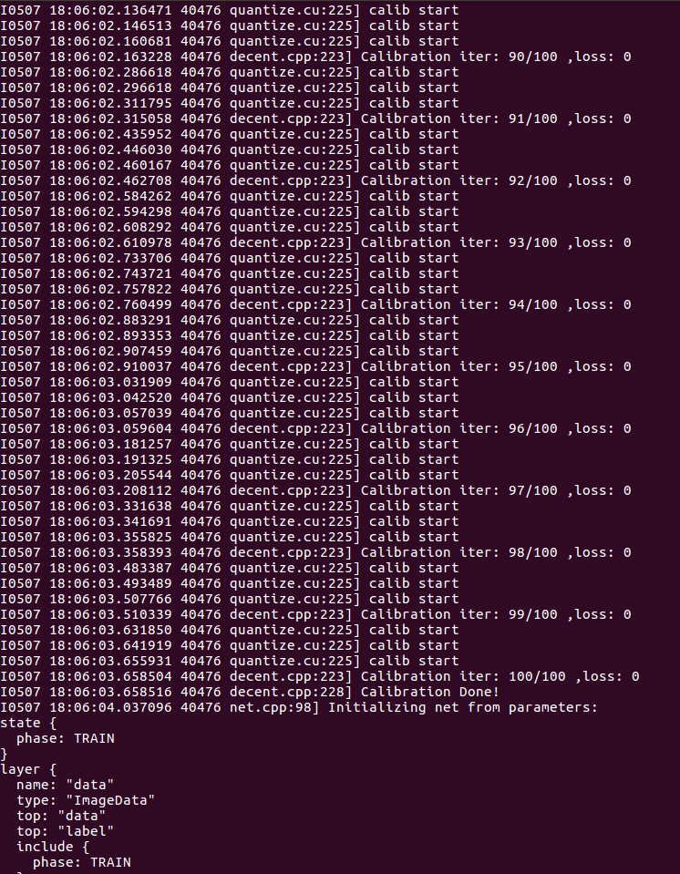

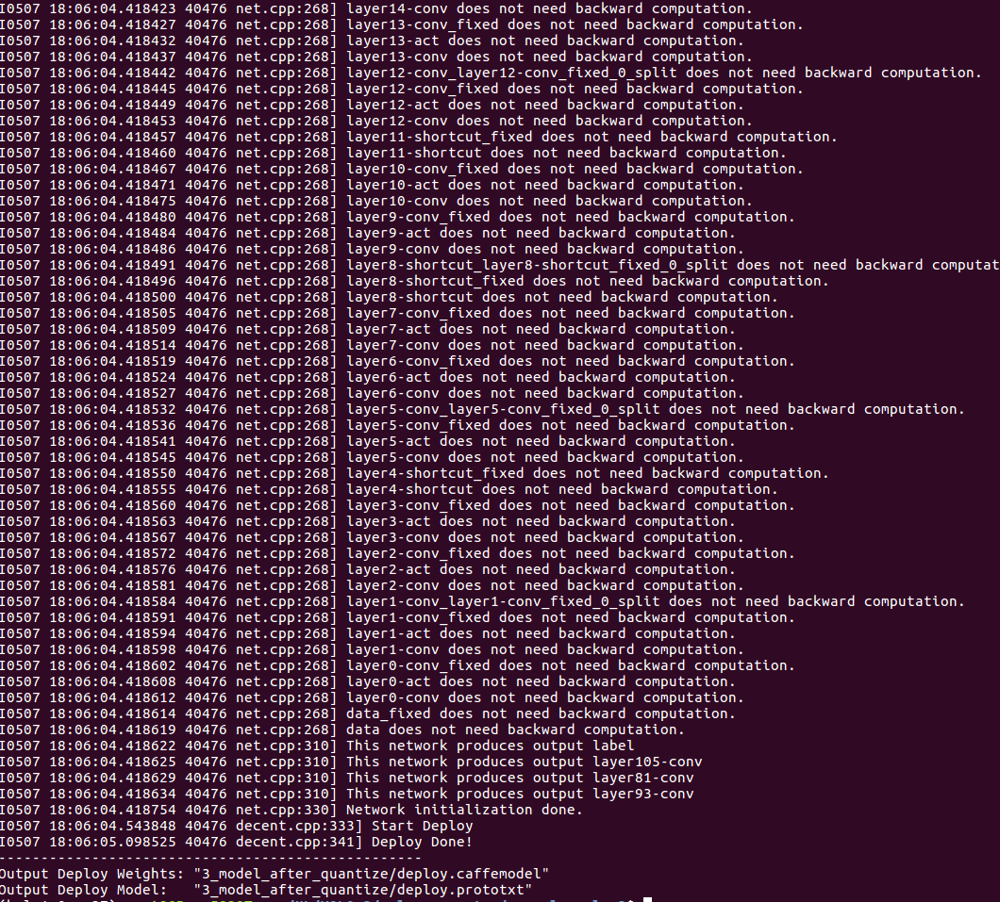

>**Note:** It is normal to see Loss values of 0 in the calibration phase, because loss layers are not included in the converted Caffe model.

In order to quantize the converted Caffe network, copy the  [v3.prototxt](example_yolov3/1_model_caffe/v3.prototxt) and
[v3.caffemodel](example_yolov3/1_model_caffe/v3.caffemodel) files from the [1_model_caffe](example_yolov3/1_model_caffe/) folder to the [2_model_for_quantize](example_yolov3/2_model_for_quantize/) folder.
Then, modify the `v3.prototxt` file by:
- Commenting out the first five lines
- Adding an **ImageData** layer with the calibration images for the train phase as shown in the following fragment:

```
name: "Darknet2Caffe"
#####Comment following five lines generated by converter#####
#input: "data"
#input_dim: 1
#input_dim: 3
#input_dim: 608
#input_dim: 608
#####Change input data layer to ImageDate and modify root_folder/source before run DECENT#####
layer {
name: "data"
type: "ImageData"
top: "data"
top: "label"
include {
  phase: TRAIN
}
transform_param {
  mirror: false
  yolo_height:608    #change height according to Darknet model
  yolo_width:608     #change width  according to Darknet model
}
image_data_param {
  source:"/PATH_TO/5_file_for_test/calib.txt"         #change path accordingly
  root_folder:"/PATH_TO/5_file_for_test/calib_data/"  #change path accordingly
  batch_size: 1
  shuffle: false
}
}
##### No changes after below layers#####
```

For your convenience, the [```v3_example.prototxt```](example_yolov3/2_model_for_quantize/v3_example.prototxt) file illustrates the changes you should do on the original [``v3.prototxt``](example_yolov3/1_model_caffe/v3.prototxt) file.

The format of [``calib.txt``](example_yolov3/5_file_for_test/calib.txt) used in the calibration phase of DNNDK ``decent`` is as follows:

```
#image_name                     fake_label_number
COCO_train2014_000000000009.jpg 1
COCO_train2014_000000000025.jpg 1
COCO_train2014_000000000030.jpg 1
COCO_train2014_000000000034.jpg 1
COCO_train2014_000000000036.jpg 1
```
>**Note:** The label number is not used in the calibration process.

The [``5_file_for_test/calib_data``](example_yolov3/5_file_for_test/calib_data) folder contains some images from the COCO dataset, to be used for the calibration process. The [``2_quantize.sh``](example_yolov3/2_quantize.sh) script performs the following actions:
```
#Assuming "decent" tool is already in the PATH
$ decent quantize -model 2_model_for_quantize/v3.prototxt        #path to prototxt \
                -weights 2_model_for_quantize/v3.caffemodel    #path to caffemodel \
                -gpu 0 \
                -sigmoided_layers layer81-conv,layer93-conv,layer105-conv \
                -output_dir 3_model_after_quantize \
                -method 1
```
In the YOLOv3 network, the ```conv``` layer before the ```yolo``` layer (that is, the output layer in Caffe model) will be quantized with the ```-sigmoided_layers``` flag for better accuracy. For more information, use the `decent –help` command or see the DNNDK User Guide [UG1327](https://www.xilinx.com/support/documentation/user_guides/ug1327-dnndk-user-guide.pdf).


## Step 4: Compile the Quantized Model

Use the following commands to compile the ELF file:
```
$ cd example_yolov3
$ cp 3_model_after_quantize/ref_deploy.prototxt 3_model_after_quantize/deploy.prototxt
$ bash 3_compile.sh
```
You will see the following:
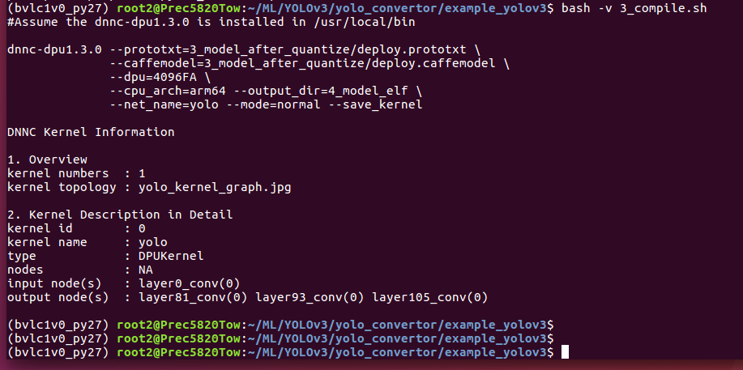

Modify the [``deploy.prototxt``](example_yolov3/3_model_after_quantize/deploy.prototxt) (generated in the previous step) in the ```3_model_after_quantize``` folder as follows:
```
layer {
name: "data"
type: "Input"
top: "data"
#####Comment following five lines #####
#transform_param {
# mirror: false
# yolo_height: 608
# yolo_width: 608
# }
#####Nothing change to below layers#####
input_param {
shape {yolov3_deploy.tar.gz
dim: 1
dim: 3
dim: 608
dim: 608
}
}
}
```

>**Note:** The [ref_deploy.prototxt](example_yolov3/3_model_after_quantize/ref_deploy.prototxt) file already contains all the above described changes. So, just copy it and rename as ```deploy.prototxt```.

The [``3_compile.sh``](example_yolov3/3_compile.sh) script uses ```dnnc``` to compile and generate the ELF file for the target ZCU102 board as follows:

```
#Assume the dnnc-dpu1.3.0 is installed in your $PATH

$ dnnc-dpu1.3.0 --prototxt=3_model_after_quantize/deploy.prototxt \
              --caffemodel=3_model_after_quantize/deploy.caffemodel \
              --dpu=4096FA \
              --cpu_arch=arm64 \
              --output_dir=4_model_elf \
              --net_name=yolo \
              --mode=normal \
              --save_kernel
```

For more information, use the `dnnc-dpu1.3.0 –help` command or see the DNNDK User Guide
[UG1327](https://www.xilinx.com/support/documentation/user_guides/ug1327-dnndk-user-guide.pdf). For other platforms, specify `--dpu` and `--cpu_arch` accordingly.


## Step 5: Deploy YOLOv3 on the ZCU102 Board
Use the following steps to deploy YOLOv3 on the ZCU102 board:

1. Copy the ``dpu_yolo.elf`` file (generated by ``dnnc``) from the [4_model_elf](example_yolov3/4_model_elf) folder, to the [``model``](yolov3_deploy/model) folder.
Then, use the following commands to archive the [``yolov3_deploy``](yolov3_deploy) folder.

  ```
  $ cd yolo_convertor
  $ cp example_yolov3/4_model_elf/dpu_yolo.elf yolov3_deploy/model/
  $ tar -cvf yolov3_deploy.tar ./yolov3_deploy
  $ gzip -v  yolov3_deploy.tar
  ```

2. Assuming that the ZCU102 board is turned on and it is connected to a 4K external monitor via Display Port, and the usual communication is setup between _target_ board and _host_ Linux PC (that is, the microUSB-to-USB cable and an Ethernet Point2Point cable), open PuTTy with the following command:
```
$ sudo putty /dev/ttyUSB0 -serial -sercfg 115200,8,n,1,N
```
3. Once the UART communication is established, execute the following command:
```
$ ifconfig eth0 192.168.1.100 netmask 255.255.255.0
```
4. From the _host_ PC execute the following command (depending on your PC, select either ``eth0`` or ``eth1``. In this case ``eth1`` is selected)
```
$ sudo ifconfig eth1 192.168.1.101 netmask 255.255.255.0
```
5. Establish the UART communication between the _host_ and the _target_.
What you have done so far, after booting the board, was to use the serial port to set the IP address of the board and ensure that the _host_ PC and _target_ board are in the same subnet.
The following screenshot illustrates this procedure:
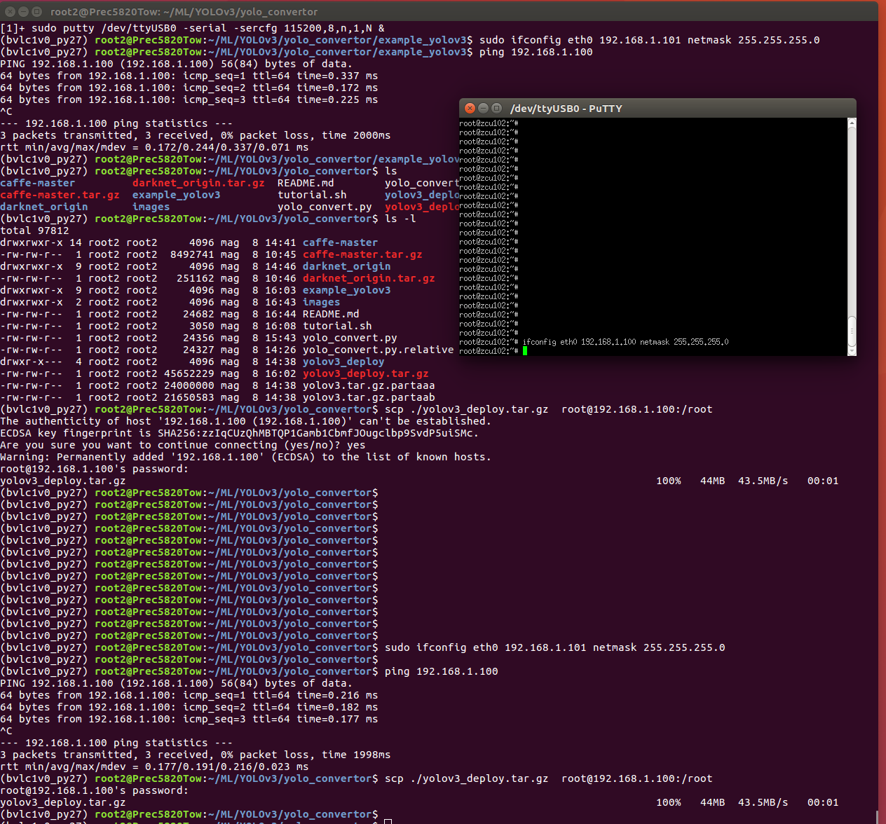

6. From your _host_ PC copy the ```yolov3_deploy.tar.gz``` file to the ZCU102 board using the ``ssh/scp`` commands:
```
$ scp yolov3_coco80_zcu102.tar root@192.168.1.100:/root
```

7. Open the archive on the board and type the following command:
```
tar -xvf yolov3_deploy.tar.gz
```
  After extraction, the files in the package are as follows:
  ```
  yolov3_deploy
  ├── coco_test.jpg
  ├── test.avi
  ├── Makefile
  ├── model
  │ └── dpu_yolo.elf
  └── src
  ├── main.cc
  └── utils.h
  ```

8. Compile the code in the ```yolov3_deploy``` folder on ZCU102 with the ```make``` command, as follows:
```
make -j
```

9. Use the following command to run the executable ```yolo```:

  ``#Test image
  ./yolo coco_test.jpg i``

  ``#Test video
./yolo test.video v
``

  You will see the following:
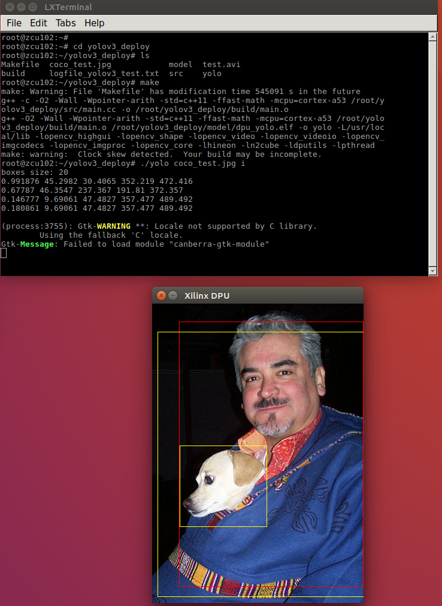
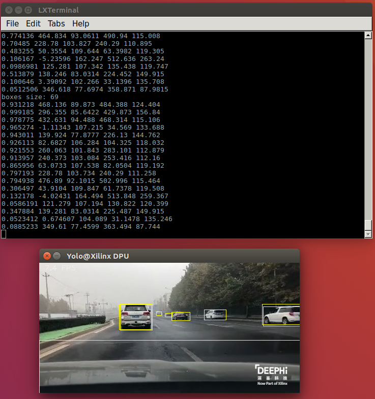


  If you are using a Windows OS PC, you can use Teraterm with the same settings as Putty, as shown below:
  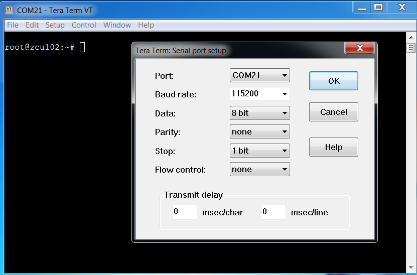

   In that case you proceed accordingly to set the IP addresses and use ```pscp.exe``` utility instead of ```scp```, as shown in the following screenshot:
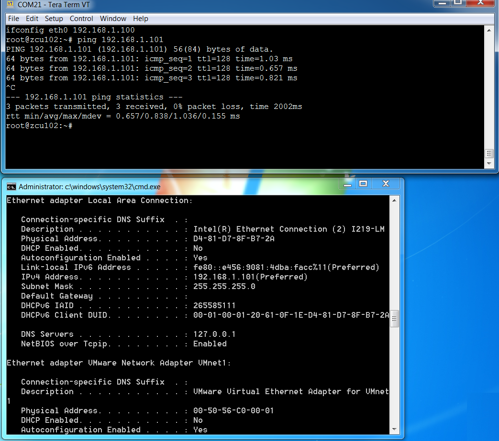
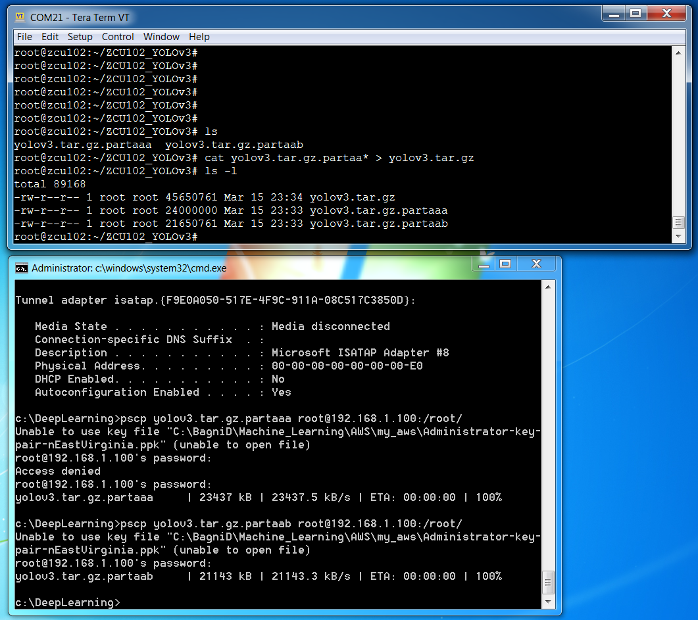

> **Note:**  For more information on setting up the ZCU102 communication, preparing to boot the SD card, connecting serial port/ethernet cables, and setting up the 4K display, see the DNNDK User Guide
[UG1327](https://www.xilinx.com/support/documentation/user_guides/ug1327-dnndk-user-guide.pdf).
